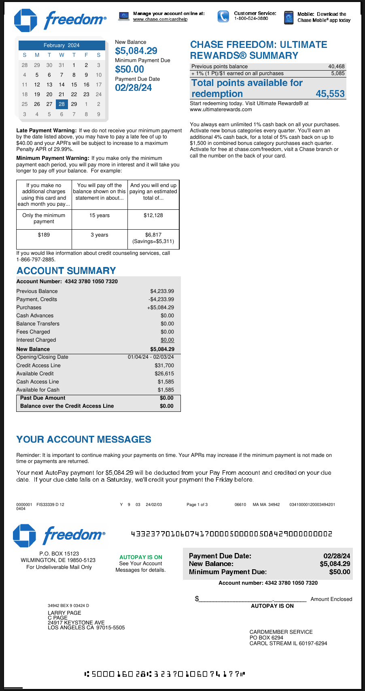

# Extracting Structured JSON from Credit Card Statements with Langchain and Pydantic

This repository contains the code for the blog post [Comparing approaches for using LLMs for Structured Data Extraction from PDFs](https://unstract.com/blog/comparing-approaches-for-using-llms-for-structured-data-extraction-from-pdfs/). The idea is to be able to develop generalized prompts that can extract structured data from credit card statements. We use Langchain to create the prompts and Pydantic to make sure that the data is in the schema as need.


This full-code approach is then contrasted with using a purpose-built environment like Unstract's Prompt Studio. The blog post goes into more detail about the pros and cons of each approach.

## Supported operating systems
You should be able to run this on Linux or on a Mac. Windows is not supported.

## Keys you'll need
You'll need keys for OpenAI and [LLMWhisperer](https://unstract.com/llmwhisperer/), which you can get for free. Please read the blog post for more information. Once you have the keys, please add them to the `.env` file in the root of the project.

## Running the code
Clone this repo and change to the `structured-extraction` directory. We suggest you run the code after you've created a Python virtual environment. You can create a virtual environment by running the following command:

```bash
python3 -m venv .venv
```

Next, activate the virtual environment:

```bash
source .venv/bin/activate
```

Now, install the dependencies:

```bash
pip install -r requirements.txt
```

Finally, run the code:
    
```bash
python extract.py <path to the credit card statement PDF or directory with PDFs>
```

# Results

## Sample input (page 1):


## Generated LLMWhisperer output

```
                                            Manage your account online at:        Customer Service:       Mobile: Download the 
                                            www.chase.com/cardhelp                1-800-524-3880          Chase Mobile® app today 
           freedom 

                                     New Balance 
          February 2024                                           CHASE FREEDOM: ULTIMATE 
   S   M    T   W    T    F    S     $5,084.29                    REWARDS® SUMMARY 
                                     Minimum Payment Due 
  28   29   30 31     1   2    3 
                                                                  Previous points balance                             40,468 
                                     $50.00                                                                            5,085 
   4   5    6    7   8    9   10                                  + 1% (1 Pt)/$1 earned on all purchases 
                                     Payment Due Date 
  11   12   13 14    15   16 17                                   Total points available for 
                                     02/28/24 
  18   19   20 21    22   23 24                                   redemption                                     45,553 
  25   26   27 28    29   1    2                                  Start redeeming today. Visit Ultimate Rewards® at 
                                                                 www.ultimaterewards.com 
   3   4    5    6   7    8    9 

                                                                  You always earn unlimited 1% cash back on all your purchases. 
Late Payment Warning: If we do not receive your minimum payment Activate new bonus categories every quarter. You'll earn an 
by the date listed above, you may have to pay a late fee of up to additional 4% cash back, for a total of 5% cash back on up to 
$40.00 and your APR's will be subject to increase to a maximum   $1,500 in combined bonus category purchases each quarter. 
Penalty APR of 29.99%.                                            Activate for free at chase.com/freedom, visit a Chase branch or 
                                                                 call the number on the back of your card. 
Minimum Payment Warning: If you make only the minimum 
payment each period, you will pay more in interest and it will take you 
longer to pay off your balance. For example: 

    If you make no     You will pay off the And you will end up 
  additional charges balance shown on this paying an estimated 
  using this card and statement in about ...    total of ... 
each month you pay ... 

  Only the minimum          15 years            $12,128 
      payment 

        $189                3 years             $6,817 
                                            (Savings=$5,311) 

If you would like information about credit counseling services, call 
1-866-797-2885. 

ACCOUNT SUMMARY 
Account Number: 4342 3780 1050 7320 
Previous Balance                                  $4,233.99 
Payment, Credits                                  -$4,233.99 
Purchases                                        +$5,084.29 
Cash Advances                                         $0.00 
Balance Transfers                                     $0.00 
Fees Charged                                          $0.00 
Interest Charged                                      $0.00 
New Balance                                       $5,084.29 
Opening/Closing Date                      01/04/24 - 02/03/24 
Credit Access Line                                  $31,700 
Available Credit                                    $26,615 
Cash Access Line                                     $1,585 
Available for Cash                                   $1,585 
 Past Due Amount                                      $0.00 
 Balance over the Credit Access Line                  $0.00 

YOUR ACCOUNT MESSAGES 

Reminder: It is important to continue making your payments on time. Your APRs may increase if the minimum payment is not made on 
time or payments are returned. 

Your next AutoPay payment for $5,084.29 will be deducted from your Pay From account and credited on your due 
date. If your due date falls on a Saturday, we'll credit your payment the Friday before. 

0000001 FIS33339 D 12                  Y 9 03    24/02/03       Page 1 of 3       06610 MA MA 34942    03410000120003494201 
0404 

                                           43323770106074170000500000508429000000002 
          freedom® 

         P.O. BOX 15123 
                                       AUTOPAY IS ON             Payment Due Date:                                  02/28/24 
  WILMINGTON, DE 19850-5123 
                                       See Your Account          New Balance:                                     $5,084.29 
    For Undeliverable Mail Only 
                                     Messages for details. 
                                                                 Minimum Payment Due:                                 $50.00 
                                                                            Account number: 4342 3780 1050 7320 

                                                                   $                                           Amount Enclosed 
            34942 BEX 9 03424 D                                                          AUTOPAY IS ON 
            LARRY PAGE 
            C PAGE 
            24917 KEYSTONE AVE 
            LOS ANGELES CA 97015-5505 
                                                                                        CARDMEMBER SERVICE 
                                                                                        PO BOX 6294 
                                                                                        CAROL STREAM IL 60197-6294 

                          50001602832370106074177 [ ] 
<<<


To contact us regarding your account: 
            Call Customer Service: 
            In U.S.          1-800-524-3880                  ? 
            Spanish          1-888-446-3308 
            Pay by phone 1-800-436-7958                  Send Inquiries to:                     Mail Payments to:                     Visit Our Website: 
            International 1-302-594-8200                 P.O. Box 15298                          P.O. Box 6294                       www.chase.com/cardhelp 
            We accept operator relay calls               Wilmington, DE 19850-5298               Carol Stream, IL 60197-6294 

    Information About Your Account                                                     cash advance, or check transaction in the amount stated in your Account Agreement. 
                                                                                       There is a foreign transaction fee of 3% of the U.S. dollar amount of any foreign 
    Making Your Payments: The amount of your payment should be at least your 
                                                                                       transaction for some accounts. Please see your Account Agreement for information 
    minimum payment due, payable in U.S. dollars and drawn on or payable through a 
                                                                                       about these fees. 
    U.S. financial institution or the U.S. branch of a foreign financial institution. You can 
    pay down balances faster by paying more than the minimum payment or the total      We add transactions and fees to your daily balance no earlier than: 
    unpaid balance on your account. 
                                                                                             1. the date of the transaction - for new purchases, balance transfers, overdraft 
     You may make payments electronically through our website or by one of our customer        advances, cash advances, or My Chase Loans; 
    service phone numbers above. In using any of these channels, you are authorizing us 
    to withdraw funds as a one-time electronic funds transfer from your bank account.        2. the date the payee deposits the check - for new cash advance checks or 
     In our automated phone system, this authorization is provided via entry of a personal     balance transfer checks; 
     identification number. You may revoke this authorization by cancelling your payment 
                                                                                            3. the date of a related transaction, the date they are posted to your account, or 
    through our website or customer service telephone numbers prior to the payment 
                                                                                               the last day of the billing cycle, whichever we may choose - for fees 
    processing. If we receive your completed payment request through one of these 
    channels by 11:59 p.m. Eastern Time, we will credit your payment as of that day, If How To Avoid Paying Interest On Purchases: Your due date will be a minimum of 21 
    we receive your request after 11:59 p.m. Eastern Time, we will credit your payment days after the close of each billing cycle. If you pay your account jor Interest Saving 
    as of the next calendar day. If you specify a future date in your request we will credit Balance) in full each billing period by the date and time due, no interest is charged 
    your payment as of that day.                                                       on new purchases month to month. Also, we will not impose interest charges on any 
                                                                                       portion of a purchase balance you repay while that balance is subject to an interest- 
    If you pay by regular U.S. mail to the Payments address shown on this statement, 
                                                                                       free period. Subject to any interest-free period for new purchases, we will begin 
    write your account number on your check or money order and include the payment 
    coupon in the envelope. Do not send more than one payment or coupon per envelope. charging interest from the date a transaction (including any balance transfer, cash 
                                                                                       advance or overdraft advancej, fee or interest charge is added to your daily balance 
    Do not staple, clip or tape the documents. Do not include correspondence. Do not 
                                                                                       until your account is paid in full. Because we apply payments in excess of your 
    send cash. If we receive your properly prepared payment on any day by 5 p.m. local 
    time at our Payments address on this statement, we will credit to your account that minimum payment first to higher rate balances, you may not be able to avoid interest 
    day. If your payment is received after 5 p.m. local time at our Payments address on charges on new purchases if you have another balance at a higher interest rate unless 
    this statement, we will credit it to your account as of the next calendar day.     you pay your balance for Interest Saving Balance) in full each month. 
    For all other payments or for any payment type above for which you do not follow our Credil Limit: If you want to inquire about your options to help prevent your account 
    payment instructions, crediting of your payments may be delayed for up to 5 days. from exceeding your credit limit, please call the number on the back of your card. 
    Account Information Reported To Credit Bureau: We may report information about     What To Do If You Think You Find A Mistake On Your Stalement: If you think there 
    your Account to credit bureaus. Late payments, missed payments or other defaults   is an error on your statement, write to us on a separate sheet at Customer Service, 
    on your Account may be reflected in your credit report. If you think we have reported P.O. Box 15299, Wilmington, DE 19850-5299. 
     inaccurate information to a credit bureau, please write to us at Chase Card Services 
                                                                                       In your letter, give us the following information: 
    P.O. Box 15369, Wilmington, DE 19850-5369. 
                                                                                            . Account information: Your name and Account number. 
    To Service And Manage Any Of Your Account(s): By providing my mobile phone 
    number, I am giving permission to be contacted at that number about all of my           . Dollar amount: The dollar amount of the suspected error. 
    accounts by JPMorgan Chase and companies working on its behalf. My consent 
    allows the use of text messages, artificial or prerecorded voice messages and           . Description of Problem: If you think there is an error on your bill, describe 
    automatic dialing technology for informational and account servicing, but not for         what you believe is wrong and why you believe it is a mistake. 
    sales or telemarketing. Message and data rates may apply. 
                                                                                       You must contact us within 60 days after the error appeared on your statement. 
    Authorization To Converl Your Check To An Electronic Transfer Debit: When you 
                                                                                       You must notify us of any potential errors in writing. You may call us or notify us 
    provide a check as payment, you authorize us either to use information from your 
                                                                                       electronically, but if you do we are not required to investigate any potential errors and 
    check to make a one-time electronic fund transfer from your account or to process 
                                                                                       you may have to pay the amount in question. 
    the payment as a check. Your bank account may be debited as soon as the same day 
    we receive your payment. You will not receive your check back from your institution. While we investigate whether or not there has been an error, the following are true; 
    Condillonal Payments: Any payment check or other form of payment that you send          . We cannot try to collect the amount in question, or report you as delinquent on 
    us for less than the full balance due that is marked "paid in full" or contains a similar that amount. 
    notation, or that you otherwise tender in full satisfaction of a disputed amount, 
     must be sent to Card Services, P.O. Box 15049, Wilmington, DE 19850-5049. We           . The charge in question may remain on your statement, and we may continue 
    reserve all our rights regarding these payments (e.g., if it is determined there is no    to charge you interest on that amount. But, if we determine that we made a 
     valid dispute or if any such check is received at any other address, we may accept       mistake, you will not have to pay the amount in question or any interest or 
    the check and you will still owe any remaining balance). We may refuse to accept          other fees related to that amount. 
    any such payment by returning it to you, not cashing it or destroying it. All other 
                                                                                            . While you do not have to pay the amount in question, you are responsible for 
    payments that you make should be sent to the regular Payment address shown on 
                                                                                              the remainder of your balance. 
    this statement. 
                                                                                            . We can apply any unpaid amount against your credit limit. 
    Annual Renewal Notice: If your Account Agreement has an annual membership 
    fee, you are responsible for it every year your Account is open. We will add your Your Rights II You Are Dissatisfied With Your Credit Card Purchases: If you are 
    annual membership fee to your monthly billing statement once a year, whether or not dissatisfied with the goods or services that you have purchased with your credit card, 
    you use your account. Your annual membership fee will be added to your purchase    and you have tried in good faith to correct the problem with the merchant, you may 
     balance and may incur interest. The annual membership fee is non-refundable unless have the right not to pay the remaining amount due on the purchase. 
    you notify us that you wish to close your account within 30 days or one billing cycle 
     (whichever is less) after we provide the statement on which the annual membership To use this right, all of the following must be true: 
    fee is billed. Your payment of the annual membership fee does not affect our rights 
                                                                                             1. The purchase must have been made in your home state or within 100 miles 
    to close your Account and to limit your right to make transactions on your Account. 
                                                                                               of your current mailing address, and the purchase price must have been 
     If your Account is closed by you or us, the annual membership fee will no longer be 
                                                                                              more than $50. (Note: Neither of these are necessary if your purchase was 
    billed to your Account. 
                                                                                               based on an advertisement we mailed to you, or if we own the company that 
     Calculation Ol Balance Subject To Interest Rate: To figure your periodic interest         sold you the goods or services.) 
     charges for each billing cycle when a daily periodic rate(s) applies, we use the 
                                                                                             2. You must have used your credit card for the purchase. Purchases made with 
    daily balance method (including new transactions). To figure your periodic interest 
    charges for each billing cycle when a monthly periodic rate(s) applies, we use the         cash advances from an ATM or with a check that accesses your credit card 
    average daily balance method (including new transactions). For an explanation of           Account do not qualify. 
    either method, or questions about a particular interest charge calculation on your      3. You must not yet have fully paid for the purchase. 
    statement, please call us at the toll free customer service phone number listed above. 
                                                                                       If all of the criteria above are met and you are still dissatisfied with the purchase, contact 
    We calculate periodic interest charges separately for each feature (for example,   us in writing at Customer Service, P.O. Box 15299, Wilmington, DE 19850-5299. 
    purchases, balance transfers, cash advances or overdraft advances). These 
    calculations may combine different categories with the same periodic rates. Variable While we investigate, the same rules apply to the disputed amount as discussed 
    rates will vary with the market based on the Prime Rate or such index described    above. After we finish our investigation, we will tell you our decision. At that point, if 
    in your Account Agreement. There is a transaction fee for each balance transfer,   we think you owe an amount and you do not pay we may report you as delinquent. 

                                                                                                                                                           MA05042021 

                                                                                                                                                                           7 

          To manage your account, including card payments, alerts, and change of address, visit 
          www.chase.com/cardhelp or call the customer service number which appears on your 
          account statement. 

 L 
<<<


                                        Manage your account online at:     Customer Service:    Mobile: Download the 
                                        www.chase.com/cardhelp             1-800-524-3880       Chase Mobile® app today 
         freedom 

  YOUR ACCOUNT MESSAGES (CONTINUED) 
 Your AutoPay amount will be reduced by any payments or merchant credits that post to your account before we 
 process your AutoPay payment. If the total of these payments and merchant credits is more than your set AutoPay 
 amount, your AutoPay payment for that month will be zero. 

  ACCOUNT ACTIVITY 

    Date of 
  Transaction                         Merchant Name or Transaction Description                        $ Amount 

 PAYMENTS AND OTHER CREDITS 
  01/28               AUTOMATIC PAYMENT - THANK YOU                                                   -4,233.99 

 PURCHASE 
  01/04               LARRY HOPKINS HONDA 7074304151 CA                                                 265.40 
 01/04                CICEROS PIZZA SAN JOSE CA                                                          28.18 
 01/05                USPS PO 0545640143 LOS ALTOS CA                                                    15.60 
 01/07                TRINETHRA SUPER MARKET CUPERTINO CA                                                 7.92 
  01/04               SPEEDWAY 5447 LOS ALTOS HIL CA                                                     31.94 
 01/06                ATT*BILL PAYMENT 800-288-2020 TX                                                  300.29 
 01/07                AMZN Mktp US*RT4G124P0 Amzn.com/bill WA                                             6.53 
  01/07               AMZN Mktp US*RT0Y474Q0 Amzn.com/bill WA                                            21.81 
  01/05               HALAL MEATS SAN JOSE CA                                                            24.33 
 01/09                VIVINT INC/US 800-216-5232 UT                                                      52.14 
  01/09               COSTCO WHSE #0143 MOUNTAIN VIEW CA                                                 75.57 
  01/11               WALGREENS #689 MOUNTAIN VIEW CA                                                    18.54 
  01/12               GOOGLE *YouTubePremium g.co/helppay# CA                                            22.99 
 01/13                FEDEX789226298200 Collierville TN                                                 117.86 
  01/19               SHELL OIL 57444212500 FREMONT CA                                                    7.16 
  01/19               LEXUS OF FREMONT FREMONT CA                                                       936.10 
 01/19                STARBUCKS STORE 10885 CUPERTINO CA                                                 11.30 
 01/22                TST* CHAAT BHAVAN MOUNTAI MOUNTAIN VIEW CA                                         28.95 
 01/23                AMZN Mktp US*R06VS6MNO Amzn.com/bill WA                                             7.67 
  01/23               UALR REMOTE PAY 501-569-3202 AR                                                  2,163.19 
  01/23               UALR REMOTE PAY 501-569-3202 AR                                                    50.00 
 01/24                AMZN Mktp US*R02SO5L22 Amzn.com/bill WA                                             8.61 
  01/24               TIRUPATHI BHIMAS MILPITAS CA                                                       58.18 
 01/25                AMZN Mktp US*R09PP5NE2 Amzn.com/bill WA                                            28.36 
 01/26                COSTCO WHSE #0143 MOUNTAIN VIEW CA                                                313.61 
  01/29               AMZN Mktp US*R25221T90 Amzn.com/bill WA                                             8.72 
  01/29               COMCAST CALIFORNIA 800-COMCAST CA                                                  97.00 
  01/29               TRADER JOE S #127 LOS ALTOS CA                                                     20.75 
 01/30                Netflix 1 8445052993 CA                                                            15.49 
 01/30                ATT*BILL PAYMENT 800-288-2020 TX                                                  300.35 
  01/30               APNI MANDI FARMERS MARKE SUNNYVALE CA                                              36.76 
 02/01                APPLE.COM/BILL 866-712-7753 CA                                                      2.99 

                                                2024 Totals Year-to-Date 
                                   Total fees charged in 2024                $0.00 
                                   Total interest charged in 2024            $0.00 
                                  Year-to-date totals do not reflect any fee or interest refunds 
                                                you may have received. 

 INTEREST CHARGES 
 Your Annual Percentage Rate (APR) is the annual interest rate on your account. 
                                            Annual                      Balance 
 Balance Type                              Percentage                  Subject To      Interest 
                                           Rate (APR)                 Interest Rate    Charges 

 PURCHASES 
    Purchases                            19.99%(v)(d)                     - 0 -          - 0 - 
 CASH ADVANCES 
    Cash Advances                       29.99%(v)(d)                      - 0 -          - 0 - 
 BALANCE TRANSFERS 
    Balance Transfers                    19.99%(v)(d)                     - 0 -          - 0 - 

LARRY PAGE                                            Page 2 of 3                          Statement Date: 02/03/24 
0000001 FIS33339 D 12               Y 9 03 24/02/03       Page 2 of 3      06610 MA MA 34942 03410000120003494202 
<<<


                                                                                                             31 Days in Billing Period 
     (v) = Variable Rate 
     (d) = Daily Balance Method (including new transactions) 
     (a) = Average Daily Balance Method (including new transactions) 
     Please see Information About Your Account section for the Calculation of Balance Subject to Interest Rate, Annual Renewal Notice, How 
     to Avoid Interest on Purchases, and other important information, as applicable. 

     IMPORTANT NEWS 

                                          Get 5% cash back on up to $1,500 in combined purchases in 
                                              this quarter's bonus categories from 1/1/24-3/31/24. 
                                                 Learn more & activate at chase.com/freedom 
                                                   or call 1-800-524-3880 by March 14, 2024. 

[X] X 0000001 FIS33339 D 12                Y 9 03     24/02/03        Page 3 of 3        06610 MA MA 34942    03410000120003494202 
<<<

```

## Extracted JSON

```json
{
    "issuer_name": "CHASE FREEDOM",
    "customer_name": "Larry Page",
    "customer_address": {
        "zip_code": "97015-5505",
        "city": "LOS ANGELES",
        "full_address": "24917 KEYSTONE AVE, LOS ANGELES, CA 97015-5505"
    },
    "payment_info": {
        "due_date": "2024-02-28T00:00:00Z",
        "minimum_payment": 50.00,
        "new_balance": 5084.29
    },
    "spend_line_items": [
        {
            "spend_date": "2024-01-04T00:00:00Z",
            "spend_description": "LARRY HOPKINS HONDA 7074304151 CA",
            "amount": 265.40
        },
        {
            "spend_date": "2024-01-04T00:00:00Z",
            "spend_description": "CICEROS PIZZA SAN JOSE CA",
            "amount": 28.18
        },
        {
            "spend_date": "2024-01-05T00:00:00Z",
            "spend_description": "USPS PO 0545640143 LOS ALTOS CA",
            "amount": 15.60
        },
        {
            "spend_date": "2024-01-07T00:00:00Z",
            "spend_description": "TRINETHRA SUPER MARKET CUPERTINO CA",
            "amount": 7.92
        },
        {
            "spend_date": "2024-01-04T00:00:00Z",
            "spend_description": "SPEEDWAY 5447 LOS ALTOS HIL CA",
            "amount": 31.94
        },
        {
            "spend_date": "2024-01-06T00:00:00Z",
            "spend_description": "ATT*BILL PAYMENT 800-288-2020 TX",
            "amount": 300.29
        },
        {
            "spend_date": "2024-01-07T00:00:00Z",
            "spend_description": "AMZN Mktp US*RT4G124P0 Amzn.com/bill WA",
            "amount": 6.53
        },
        {
            "spend_date": "2024-01-07T00:00:00Z",
            "spend_description": "AMZN Mktp US*RT0Y474Q0 Amzn.com/bill WA",
            "amount": 21.81
        },
        {
            "spend_date": "2024-01-05T00:00:00Z",
            "spend_description": "HALAL MEATS SAN JOSE CA",
            "amount": 24.33
        },
        {
            "spend_date": "2024-01-09T00:00:00Z",
            "spend_description": "VIVINT INC/US 800-216-5232 UT",
            "amount": 52.14
        },
        {
            "spend_date": "2024-01-09T00:00:00Z",
            "spend_description": "COSTCO WHSE #0143 MOUNTAIN VIEW CA",
            "amount": 75.57
        },
        {
            "spend_date": "2024-01-11T00:00:00Z",
            "spend_description": "WALGREENS #689 MOUNTAIN VIEW CA",
            "amount": 18.54
        },
        {
            "spend_date": "2024-01-12T00:00:00Z",
            "spend_description": "GOOGLE *YouTubePremium g.co/helppay# CA",
            "amount": 22.99
        },
        {
            "spend_date": "2024-01-13T00:00:00Z",
            "spend_description": "FEDEX789226298200 Collierville TN",
            "amount": 117.86
        },
        {
            "spend_date": "2024-01-19T00:00:00Z",
            "spend_description": "SHELL OIL 57444212500 FREMONT CA",
            "amount": 7.16
        },
        {
            "spend_date": "2024-01-19T00:00:00Z",
            "spend_description": "LEXUS OF FREMONT FREMONT CA",
            "amount": 936.10
        },
        {
            "spend_date": "2024-01-19T00:00:00Z",
            "spend_description": "STARBUCKS STORE 10885 CUPERTINO CA",
            "amount": 11.30
        },
        {
            "spend_date": "2024-01-22T00:00:00Z",
            "spend_description": "TST* CHAAT BHAVAN MOUNTAI MOUNTAIN VIEW CA",
            "amount": 28.95
        },
        {
            "spend_date": "2024-01-23T00:00:00Z",
            "spend_description": "AMZN Mktp US*R06VS6MNO Amzn.com/bill WA",
            "amount": 7.67
        },
        {
            "spend_date": "2024-01-23T00:00:00Z",
            "spend_description": "UALR REMOTE PAY 501-569-3202 AR",
            "amount": 2163.19
        },
        {
            "spend_date": "2024-01-23T00:00:00Z",
            "spend_description": "UALR REMOTE PAY 501-569-3202 AR",
            "amount": 50.00
        },
        {
            "spend_date": "2024-01-24T00:00:00Z",
            "spend_description": "AMZN Mktp US*R02SO5L22 Amzn.com/bill WA",
            "amount": 8.61
        },
        {
            "spend_date": "2024-01-24T00:00:00Z",
            "spend_description": "TIRUPATHI BHIMAS MILPITAS CA",
            "amount": 58.18
        },
        {
            "spend_date": "2024-01-25T00:00:00Z",
            "spend_description": "AMZN Mktp US*R09PP5NE2 Amzn.com/bill WA",
            "amount": 28.36
        },
        {
            "spend_date": "2024-01-26T00:00:00Z",
            "spend_description": "COSTCO WHSE #0143 MOUNTAIN VIEW CA",
            "amount": 313.61
        },
        {
            "spend_date": "2024-01-29T00:00:00Z",
            "spend_description": "AMZN Mktp US*R25221T90 Amzn.com/bill WA",
            "amount": 8.72
        },
        {
            "spend_date": "2024-01-29T00:00:00Z",
            "spend_description": "COMCAST CALIFORNIA 800-COMCAST CA",
            "amount": 97.00
        },
        {
            "spend_date": "2024-01-29T00:00:00Z",
            "spend_description": "TRADER JOE S #127 LOS ALTOS CA",
            "amount": 20.75
        },
        {
            "spend_date": "2024-01-30T00:00:00Z",
            "spend_description": "Netflix 1 8445052993 CA",
            "amount": 15.49
        },
        {
            "spend_date": "2024-01-30T00:00:00Z",
            "spend_description": "ATT*BILL PAYMENT 800-288-2020 TX",
            "amount": 300.35
        },
        {
            "spend_date": "2024-01-30T00:00:00Z",
            "spend_description": "APNI MANDI FARMERS MARKE SUNNYVALE CA",
            "amount": 36.76
        },
        {
            "spend_date": "2024-02-01T00:00:00Z",
            "spend_description": "APPLE.COM/BILL 866-712-7753 CA",
            "amount": 2.99
        }
    ]
}
```